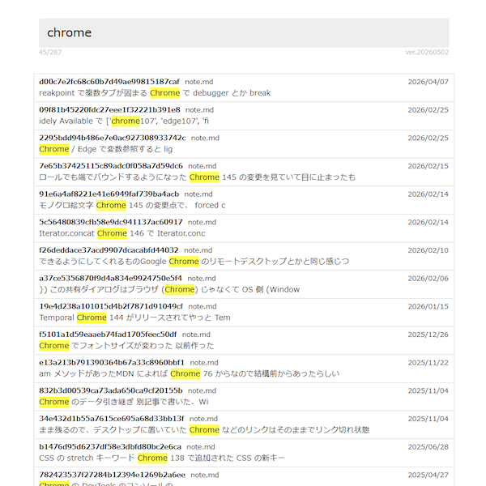

# Gist Search

元はこれ  

- https://gist.github.com/0RIM0/eaad5bc5d5d8ca82c4f3d448f82d66ce

手動でデータ更新が面倒だったので CI でやるために別リポジトリに移した

## 概要

Gist の検索がイマイチなので自分で検索できるようにしたもの  
検索用のデータを事前に作ってそれをダウンロードしてブラウザ内で検索する  
検索自体は本文のテキストマッチングのみ  

## 検索画面

文字列入力の input がひとつだけなので見たまま  

   

検索対象のデータは固定ではなくクエリパラメーターで URL を指定してそれをダウンロードして使う  
`?data=<url>`  

https://0rim0.github.io/gist-search/?data=gist-data.zst  

## データ

データフォーマットさえ揃っていれば好きなものを検索するデータとして使える  
フォーマットは JSON か JSON 単体を圧縮した zstd ファイル  
JSON フォーマットは  

```
{
    "timestamp": "日時の文字列",
    "gists": [
        [id, filename, created_at, text],
        [id, filename, created_at, text],
        [id, filename, created_at, text],
        ...
    ]
}
```

- `timestamp`: `new Date().toJSON()` の形式
- `id`: Gist の ID
- `filename`: Gist のファイル名
- `created_at`: Gist の作成日時
- `text`: 検索対象の本文

## Generator 

Gist データを収集して上記フォーマットの JSON を作る  
対象は markdown ファイルのみ  

### オプション

- `--user` (`-u`)
  - 収集対象のユーザー
- `--min-date`
  - 収集範囲の開始日時
  - デフォルト: 2018-01-01
- `--max-date`
  - 収集範囲の終了日時
  - デフォルト: 2099-12-31
- `--min-text-length`
  - 必要な文字数（この文字数未満のファイルはスキップ）
  - デフォルト: 50
- `--output` (`-o`)
  - 出力するファイル名
  - デフォルト: `gist-data.json`
- `--cache` (`-c`)
  - キャッシュを保存・参照するパス
  - 指定なしや空文字ならキャッシュなし
- `--skip-interval`
  - キャッシュのタイムスタンプからの経過時間がこの秒数以下なら取得をスキップ
  - デフォルト: 1日
- `--no-update-check`
  - 更新の有無をチェックをしない
  - これを指定しない場合は最初にキャッシュのタイムスタンプ以降に更新があるかチェックして無い場合は取得をスキップ
  - デフォルト: `false`

### 流れ

スキップやキャッシュ周りについて

- キャッシュから最終結果の JSON を読み取りタイムスタンプ部分を取り出す
- 前回のタイムスタンプから skip-interval の時間が経っていないなら取得はスキップして前回の結果を使いまわし
- no-update-check が指定されていないなら前回のタイムスタンプ以降の更新の有無をチェックして更新がないなら取得はスキップして前回の結果を使いまわし
- キャッシュが無い場合やスキップしない場合は取得処理開始
- 個別のファイルごとにもキャッシュしてるので変化のない Gist は再取得をスキップ

### ログの記号

- キャッシュヒットありの 1 ファイル処理完了 → `,`
- キャッシュヒットなしの 1 ファイル処理完了 → `.`
- 1 Gist 処理完了 → `:`

## CI

Gist を収集して検索データの生成と Pages 用の検索画面のビルドの両方をまとめて行う  
生成したデータは公開フォルダのトップレベルに `gist-data.zst` として公開  
`?data=gist-data.zst` の指定で参照できる  
